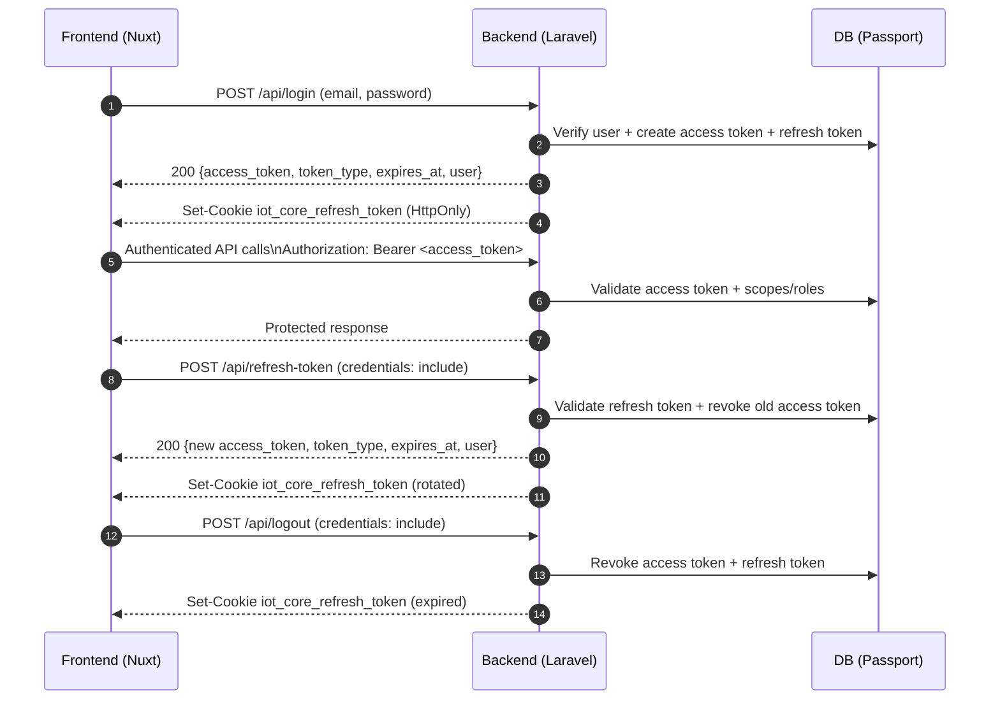

# IoT Core Backend

This repository serves as the central backend service for the IoT-core platform, handling authentication, user management, and IoT device control through a modular architecture built on the Laravel framework.

## Core Features

The backend provides centralized authentication with Laravel Passport, including login, token refresh, logout, registration, and password changes for web and service clients while managing personal access and password grant clients. It delivers user and company account manage features with role-aware access, filtering, and updates, plus admin-only visibility into system logs and metrics such as weekly log counts for audit and monitoring workflows. The Control Module exposes versioned endpoints to manage gateways, nodes, and control URLs, including registration, deactivation, execution, and deletion actions, alongside a public endpoint for listing available active nodes. The Map Module provides versioned endpoints to manage areas and maps used by location features.

---

## Auth Flow (Frontend ↔ Backend)

This project uses Laravel Passport access tokens (Bearer) plus an HTTP-only refresh token cookie. The frontend never reads the refresh token directly; it relies on `credentials: "include"` so the browser attaches the cookie.



### Key endpoints used by the frontend
1. `POST /api/login` issues an access token and sets the refresh cookie.
2. `POST /api/refresh-token` rotates tokens using the refresh cookie.
3. `POST /api/logout` revokes tokens and expires the refresh cookie.

### Implementation references
1. Backend auth controller and refresh cookie handling: `backend/app/Http/Controllers/Api/AuthController.php`
2. Access/refresh token issuance and revocation: `backend/app/Services/AuthService.php`
3. Passport token TTL configuration: `backend/app/Providers/AppServiceProvider.php`
4. Frontend login + token storage: `frontend/app/pages/login.vue`, `frontend/stores/auth.ts`
5. Frontend refresh middleware: `frontend/app/middleware/auth.global.ts`

---

## Technical Setup

### 1. Prerequisites
- PHP 8.2 or higher
- Composer
- Node.js 18 or higher (for asset compilation)
- MySQL or a compatible relational database

### 2. Installation Steps

1. **Install Dependencies**
   ```bash
   composer install
   npm install
   ```

2. **Environment Configuration**
   ```bash
   cp .env.example .env
   php artisan key:generate
   ```
   *Configure your database connection details and service token settings in the newly created `.env` file.*

### Backend -> Server Service Token

The backend calls the Node server as an internal microservice and now authenticates with a shared service token.

Set these variables in `backend/.env`:

```env
NODE_SERVER_BASE_URL=http://localhost:8017
NODE_SERVER_SERVICE_TOKEN=replace-with-strong-shared-token
```

The same token must be configured on server side as `SERVICE_TOKEN` in `server/.env`.

Current backend services that send this token:
1. `ControlCommandExecutionService` (`/v1/control/*`)
2. `WorkflowRunService` (`/v1/device-status`, `/v1/sensors/query`)
3. `NodeManagementService` (`/v1/whitelist`)

3. **Database Initialization**
   ```bash
   php artisan migrate --seed
   ```

4. **Passport Initialization**
   ```bash
   php artisan install:api --passport
   php artisan passport:keys --force
   ```
   *This generates the RSA keys required for secure token signing in the `storage/` directory.*

5. **Personal Access Client Setup**
   ```bash
   php artisan passport:client --personal
   ```

### 3. Running the Application

- **Option A (recommended): run all required dev processes**
  ```bash
  composer dev
  ```
  This starts Laravel server, queue worker, logs, and Vite together.
  On Windows, use:
  ```bash
  composer dev:win
  ```
  (`php artisan pail` requires `pcntl`, which is not available on Windows.)

- **Option B: run manually in separate terminals**
  Terminal 1:
  ```bash
  php artisan serve
  ```
  Terminal 2:
  ```bash
  php artisan queue:work
  ```
  Terminal 3 (if frontend assets are needed):
  ```bash
  npm run dev
  ```

### 4. Workflow Execution Queue (Control Module)

Workflow execution is now handled asynchronously to avoid blocking HTTP workers.

#### Request flow
1. Client calls `POST /api/v1/workflows/{workflow}/run`.
2. `WorkflowController::run()` creates a `run_id`, dispatches `RunWorkflowJob` to the queue, and returns `202 Accepted` with:
   ```json
   {
     "run_id": "<run-id>",
     "workflow_id": "<id>",
     "status": "queued"
   }
   ```
3. Client polls run events: `GET /api/v1/workflows/runs/{run_id}/events?offset=<n>`.
4. Queue worker picks up `RunWorkflowJob`.
5. Job resolves workflow + actor and calls `WorkflowRunService::run($workflow, $actor)`.
6. Service executes workflow steps (`action`, `condition`), sends control commands, records logs/events, and emits notifications (`workflow.run.completed` or `workflow.run.failed`).

#### Why queue is required
- Workflow actions may include wait durations (for example `duration_seconds = 10`) and control-response waits.
- Running this in a queue prevents long waits from occupying web request workers.

#### Required worker process
At least one queue worker must be running (either started by `composer dev` or manually):

```bash
php artisan queue:work
```

If no worker is running, run requests will stay in `queued` state and not execute.

#### Current behavior note
- `run` endpoint (`POST /run`) is queued (async).
- `run/stream` now delegates to the same queued run-start behavior and no longer executes workflow in-request.

---

## Utility Commands

- `composer setup`: Orchestrates dependency installation, environment setup, migrations, and builds.
- `php artisan test`: Executes the automated test suite.
- `php artisan storage:link`: Establishes the symbolic link for public file storage.

For detailed information on the setup process, refer to `docs/Setup_tutorial.txt` or contact the development team.
