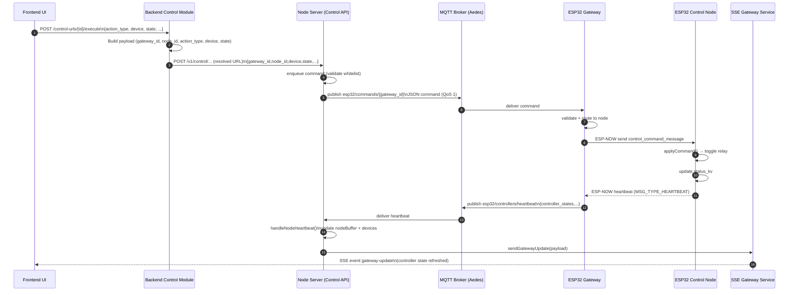

```mermaid
sequenceDiagram
    autonumber
    participant UI as Frontend UI
    participant CM as Backend Control Module
    participant NS as Node Server (Control API)
    participant MQTT as MQTT Broker (Aedes)
    participant GW as ESP32 Gateway
    participant CN as ESP32 Control Node
    participant SSE as SSE Gateway Service

    UI->>CM: POST /control-urls/{id}/execute\n{action_type, device, state, ...}
    CM->>CM: Build payload (gateway_id, node_id, action_type, device, state)
    CM->>NS: POST /v1/control/... (resolved URL)\n{gateway_id,node_id,device,state,...}

    NS->>NS: enqueue command (validate whitelist)
    NS->>MQTT: publish esp32/commands/{gateway_id}\nJSON command (QoS 1)

    MQTT->>GW: deliver command
    GW->>GW: validate + route to node
    GW->>CN: ESP-NOW send control_command_message

    CN->>CN: applyCommand() → toggle relay
    CN->>CN: update status_kv

    CN-->>GW: ESP-NOW heartbeat (MSG_TYPE_HEARTBEAT)
    GW->>MQTT: publish esp32/controllers/heartbeat\n{controller_states,...}

    MQTT->>NS: deliver heartbeat
    NS->>NS: handleNodeHeartbeat()\nupdate nodeBuffer + devices
    NS->>SSE: sendGatewayUpdate(payload)
    SSE-->>UI: SSE event gateway-update\n(controller state refreshed)

```
